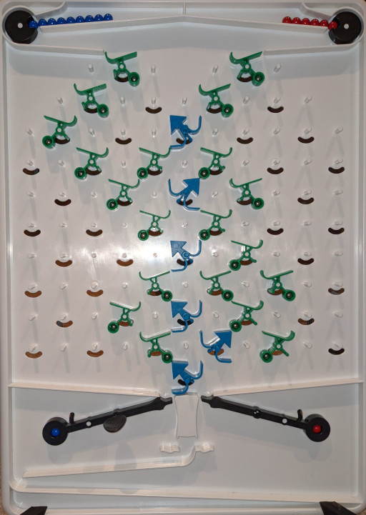

# Turing Tumble Solver

The [Turing Tumble](https://www.turingtumble.com/) (TM) is a marble-powered computer that can be "programmed" by placing 6 types of parts on a board. While various simulators exist, I could find no solvers on the internet yet.

## Turing Tumble as a single-instruction computer

There are quadrillions of ways in which the 6 parts can be placed on the board. When thinking about the Turing Tumble on this level, it seems practically impossible to automatically solve puzzles by searching the solution space.

However, the Turing Tumble becomes more tractable if we describe it on the level of the logical operations it performs, and ignore the physical routing of balls or positioning of parts on the board.

On this higher level, the Turing Tumble's can be described as a single-instruction computer. The only instruction is `invert-and-branch`, (abbreviated `ijmp`). It inverts one bit of memory at `$memory_address`, then jumps to instruction `$jmp0` if the bit became 0 or to `$jmp1` if the bit became 1.

```
ijmp $memory_address $jmp0 $jmp1
```

Only forward jumps (i.e. to *higher* instruction addresses) are allowed. This corresponds to marbles travelling *downwards* on the board. Conveniently, this avoids infinite loops.

There are special addresses for the left and right lever (labelled `B` and `R`), and a maximum of 3 interceptor addresses (labelled `INTERC0`-`INTERC2`). When these addresses are reached, the board releases a blue or red ball, or intercepts the ball and halts the machine. This would be somewhat similar to a kernel handling page faults.

A program also needs to specify the entrypoint addresses where the blue and red balls start when released by the board. A complete program would look like this:

```
# 4 bit counter, counts the blue balls.

start: b          # start button releases a blue ball
start_blue: 0     # blue ball enters at instruction 0 
start_red:  0     # never exercised in this program

mem:
	0: 0  # these 4 bits form the register
	1: 0
	2: 0
	3: 0

instr:
	0: ijmp 0 1 B
	1: ijmp 1 2 B
	2: ijmp 2 3 B
	3: ijmp 3 B B
```

Because there is only one instruction, emulation (implemented in module `magnus`) is blazing fast. A complete puzzle with a 16 ball input is typically executed in less than 100 ns. I.e. tens of millions of programs can be tried per second.

### Modelling bits versus gear bits

Note that the Turing Tumble's "bit" part is modelled by an `ijmp` where `$memory_address` is not shared with any other instruction. Conventionally chosen equal to the instruction's address. E.g.

 **`3`**`: ijmp `**`3`**` R B   # no other instructions access memory[3]`

 A "gear bit" part is modelled by an `ijmp` where the `$memory_address` is equal to that of another instruction. I.e. the two gears are coupled -- flipping one flips the other. E.g. these two instructions model two coupled gear bits, they both write to memory address `0`.

 ```
# two coupled gear bits
instr:
	0: ijmp 0 1 B   # accesses memory[0]
	1: ijmp 0 R B   # also accesses memory[0]
 ```


## Solver

In this high-level representation, the total number of possible programs is actually reasonably small. E.g a there are only about half a billion such programs that represent Turing Tumble boards with up to 6 "bit" parts. This is astronically smaller than the quadrillions of possible physical realisations of those programs, and can be searched by brute force. Once a solution has been found, it is actually quite trivial for a human to translate it into a physical realisation on the board.

I have implemented such solver as a Rust module named `alia` (after the fictional character that solves the puzzles in the Turing Tumble book).

Puzzles are specified by the number of bits allowed to be used, and test function that tells whether a proposed solution is correct. E.g. for the 4-bit counter shown earlier, the Puzzle Book specifies: "Count the number of blue balls in register A. Use 15 or fewer balls." This translates to:

```
alia::solve_bits(               // only "bits" allowed, no gear bits
    &State::new(4),             // 4 instructions can be used
    &[B],                       // Only Blue balls can be used, no red balls or interceptors
    |program| {                 // Tests correctness
          for n in 0..16 {
              if program.with_balls([n, 0]).run().register(0..4) != n as u64 {
                  return false;
              }
          }
          true
})
```

It finds the 4-bit counter program shown above in about 100 microseconds.

As a more challenging puzzle that is not in the Puzzle Book, I searched for a program that outputs 1 blue, 2 red, 3 blue, 4 red and 5 blue balls.

The specification reads:

```
alia::solve_bits(&State::new(6).with_balls([9, 6]), &[B, R], |p| {
    p.clone().run().out_seq.eq(&[
        Blue, Red, Red, Blue, Blue, Blue, Red, Red, Red, Red, Blue, Blue, Blue, Blue, Blue,
    ])
})
```

The solver finds this program in about 1 minute:

```
start: b
start_blue: 2
start_red: 0
mem:
        0: 0
        1: 0
        2: 0
        3: 0
        4: 0
        5: 0
instr:
        0: ijmp 0 1 R
        1: ijmp 1 R 2
        2: ijmp 2 B 3
        3: ijmp 3 B 4
        4: ijmp 4 R 5
        5: ijmp 5 B R
```

### No need to solve for memory

Note: in the above example, the initial memory contents can be freely chosen (unlike the 4-bit counter example where the memory is interpreted as an output register). However, it is not needed to search through variations of a program's initial memory state, as replacing a `0` by a `1` simply corresponds to mirroring the part, i.e., switching the left and right outputs. This can be exploited when physically building a program on the board. If, e.g., an output is tricky to route, one can simply flip the "bit" direction and switch the left and right outputs.

A physical realisation of the above program, exploiting the option to flip bits, looks like this:



When run, it correctly outputs `B RR BBB RRRR BBBBB`.
